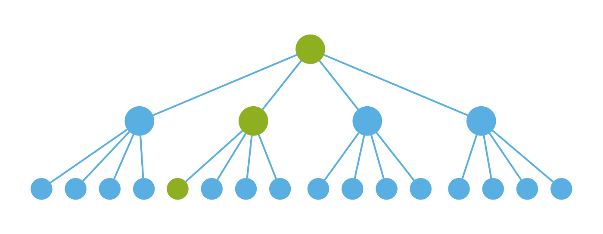
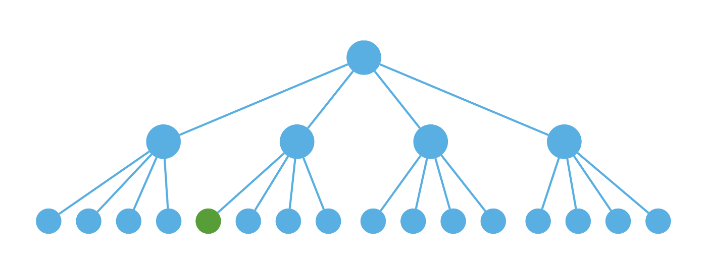

# Participants Store: React Performance Optimization Practice

Participants have nested data structure for UI to render. For example,  `pariticpants - some participant - pose - position`. In [prototype 1](https://github.com/hasevr/jitsi-party), We've found that naive way of updating UI would cause lag after user interaction (like change local participant position with keyboard). For more fluid interaction, the following are our tries to optimize the performance of React.

## 1. Avoid using props for message passing
In [round 1](https://medium.com/@alexandereardon/performance-optimisations-for-react-applications-b453c597b191) and [round 2](https://medium.com/@alexandereardon/performance-optimisations-for-react-applications-round-2-2042e5c9af97), author have introduced ways to improve performance. He proposed to use connected components to update specific node on virtual DOM directly. That avoids costs on reconciliation & render on its ancestor nodes.

In storybook, `store-participants` demonstrate how we put that idea into practice.

```js
const participants = {
    particpant_0: {
        pose: {
            position: [0, 0],
            orientation: 0
        },
        information: {
            name: 'name'
        }
    },
    ...
    participant_N: {
        ...
    }
}
```

We want to render participants list into UI. If we change only one participants' position, let's see how it would works:

1. If we use props to pass the change from root node, a lot of computation time would be wasted on reconciling the things that would not change:

   

2. If we connect every participant directly to the store, parent nodes would not be reconciliated

   


## References
- [Dragging React Performance Forward](https://medium.com/@alexandereardon/dragging-react-performance-forward-688b30d40a33)
