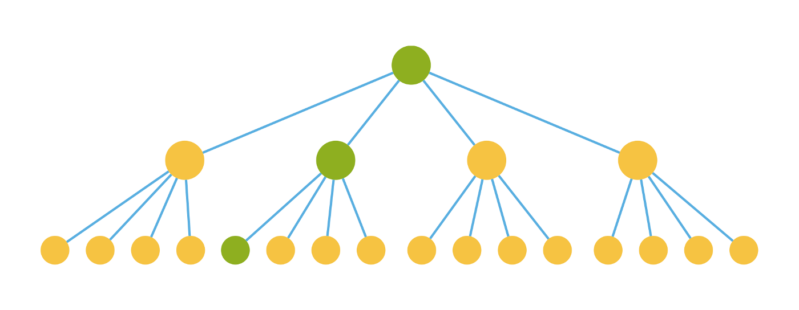

# Participants Store: React Performance Optimization Practice

Participants have nested data structure for UI to render. For example,  `pariticpants - some participant - pose - position`. In [prototype 1](https://github.com/hasevr/jitsi-party), We've found that naive way of updating UI would cause lag after user interaction (like change local participant position with keyboard). For more fluid interaction, the following are our tries to optimize the performance of React.

## 1. Avoid using props for message passing
### Theory

In [round 1](https://medium.com/@alexandereardon/performance-optimisations-for-react-applications-b453c597b191) and [round 2](https://medium.com/@alexandereardon/performance-optimisations-for-react-applications-round-2-2042e5c9af97), author have introduced ways to improve performance. 

He proposed to use：

1. use `shouldComponentUpdate` to avoid re-render on sibling nodes.

2. connected components to update specific node on virtual DOM directly. That avoids costs on reconciliation & render on its ancestor nodes.

### Practice

In storybook, `store-participants` demonstrate how we put that idea into practice. (MobX + React Hooks)

```js
const participants = {
    particpant_0: {
        pose: {
            position: [0, 0],
            orientation: 0
        },
        information: {
            name: 'name'
        }
    },
    ...
    participant_N: {
        ...
    }
}
```

We want to render participants list into UI. If we change only one participants' position, let's see how it would works:

1. If we use props to pass the change from root node, a lot of computation time would be wasted on reconciling and rendering the data that did not change:

   

2. To avoid re-rendering on sibling nodes (yellow ones on the upper image), we can use `useMemo` hook to remember the participant node. Only re-render it  when the id of participant have changed (add / delete).

   

3. If we connect every participant directly to the store (connect to MobX using `useContext` hook), parent nodes would not be reconciliated.

   


## References
- [Dragging React Performance Forward](https://medium.com/@alexandereardon/dragging-react-performance-forward-688b30d40a33)
